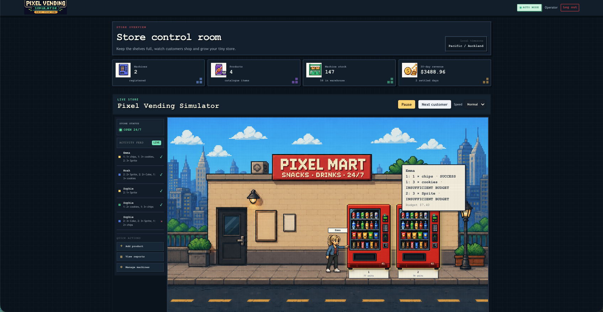
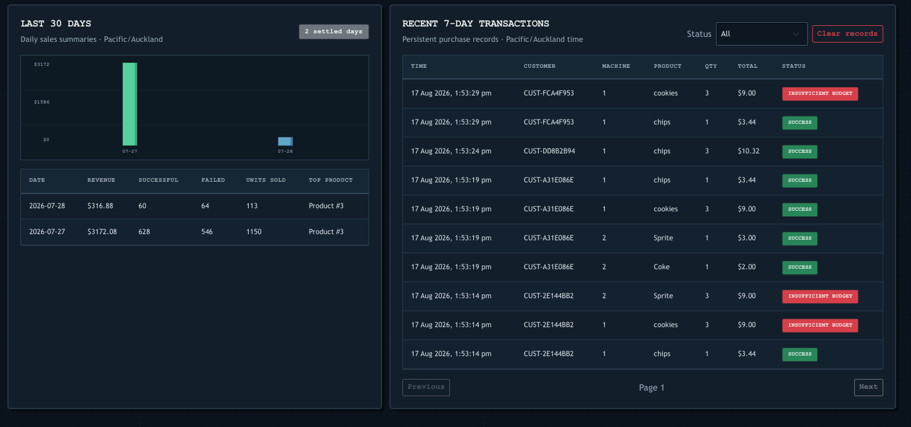
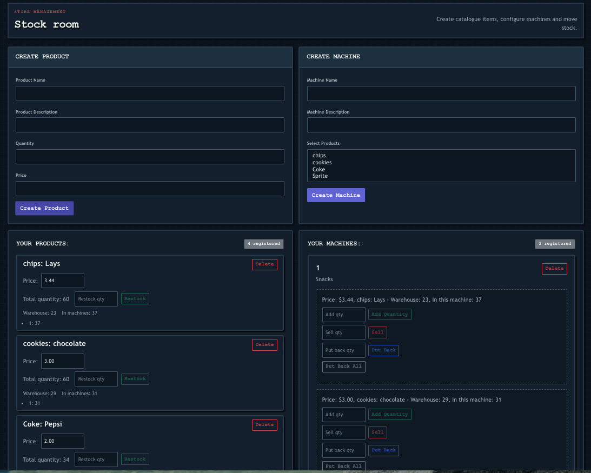
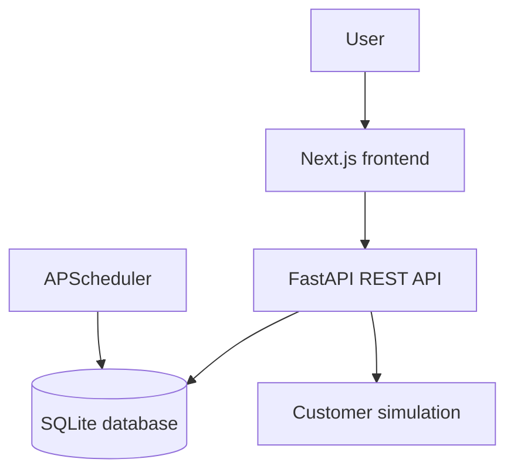

# Pixel Vending Simulator

[](https://github.com/BohanDun/vending_machine_management/actions/workflows/ci.yml)

A full-stack pixel-art vending machine simulator built with FastAPI, SQLite,
SQLAlchemy, Alembic, Next.js, and React.


Users manage products, warehouse inventory, prices, and vending machines while
virtual customers automatically visit the store and make randomized purchases.
The application records transactions, restocks machines after stockouts, and
creates daily sales summaries in the Pacific/Auckland timezone.

## Highlights

- A live pixel-art store where animated customers visit vending machines and
  display their purchase results.
- End-to-end inventory flows across warehouse stock, machine capacity,
  purchases, stockouts, and automatic supplier delivery.
- Operational dashboards covering revenue, transaction outcomes, units sold,
  and top-performing products.
- Authenticated full-stack application with a REST API, relational data model,
  migrations, scheduled jobs, and automated service tests.

## Screenshots

### Live store dashboard

Monitor store activity, inventory totals, revenue, and customer purchases from
the main control room.



### Sales reports

Review 30-day sales summaries alongside filterable transaction history.



### Inventory and machine management

Create products and machines, update prices, and move inventory between the
warehouse and individual vending machines.



## Features

### Store management

- Register and sign in with JWT authentication.
- Create products with a name, description, starting quantity, and price.
- Change product prices and manually restock the warehouse.
- Create up to four vending machines.
- Assign products to machines and move stock between machines and the warehouse.
- Pause automatic simulation when inventory is changed manually.

### Customer simulation

- Generate virtual customers with randomized names, budgets, and pixel-art
  appearances.
- Purchase random quantities of one or more products.
- Purchase from multiple vending machines in a single visit.
- Record successful purchases and failures such as insufficient budget and
  out-of-stock products.
- Display customer movement and purchase results in the Pixel Mart scene.

### Inventory automation

- Each machine product slot has a capacity of 50 units.
- Automatic restocking is triggered after an out-of-stock purchase.
- If warehouse stock is insufficient, supplier delivery increases warehouse
  stock before the machine is refilled.
- Inventory changes and purchases are handled through database transactions.

### Sales history

- Keep detailed transaction records for the most recent seven days.
- Keep daily sales summaries for the most recent 30 days.
- Settle the previous day automatically at midnight in Pacific/Auckland time.
- Catch up on missed settlement tasks when the backend starts.
- Display revenue, successful and failed transactions, units sold, and the
  top-selling product.

## Technology

| Area | Technology |
| --- | --- |
| Backend | Python 3.12, FastAPI, SQLAlchemy, Pydantic |
| Database | SQLite, Alembic |
| Authentication | JWT, python-jose, Passlib, bcrypt |
| Scheduler | APScheduler |
| Frontend | Next.js 15, React 19, Axios, Bootstrap |
| Testing | Python unittest |

## Architecture



The frontend communicates with the FastAPI backend through authenticated REST
endpoints. Business operations such as purchases, inventory transfers, and
automatic restocking are handled by backend services and persisted through
SQLAlchemy. APScheduler creates daily sales summaries and performs retention
cleanup.

## Engineering Decisions

### Transactional inventory updates

Purchase validation and inventory changes are handled by backend services.
Successful purchases update stock and create transaction records within the
database transaction, while rejected purchases are recorded with an explicit
failure status.

### Shared purchase pipeline

Randomly generated customers use the same purchase service, inventory
validation, and transaction recording logic as other purchase requests. This
keeps simulated activity consistent with the application's business rules.

### Missed-task recovery

The scheduler settles sales at midnight in the Pacific/Auckland timezone. On
startup, the backend also processes recent unsettled dates so summaries are not
lost when the application was offline at midnight.

## Project structure

```text
pixel_vending/
├── backend/
│   ├── api/
│   │   ├── models/
│   │   ├── routers/
│   │   ├── schemas/
│   │   ├── services/
│   │   ├── database.py
│   │   ├── deps.py
│   │   └── main.py
│   ├── migrations/
│   ├── tests/
│   ├── alembic.ini
│   └── requirements.txt
├── docs/
│   ├── dashboard.png
│   ├── demo.gif
│   ├── inventory-management.png
│   └── reports.png
├── frontend/
│   ├── public/assets/
│   ├── src/lib/
│   ├── src/app/
│   ├── .env.example
│   ├── eslint.config.mjs
│   ├── package.json
│   └── package-lock.json
├── .gitignore
├── dev.sh
└── README.md
```

## Local setup

### Requirements

- Python 3.12
- Node.js 20 or later
- npm

### 1. Create the Python environment

From the project root:

```bash
python3.12 -m venv .venv
source .venv/bin/activate
python -m pip install --upgrade pip
python -m pip install -r backend/requirements.txt
```

### 2. Configure backend environment variables

Copy the provided example, then replace its development secret:

From the project root:

```bash
cp backend/.env.example backend/.env
```

`backend/.env` contains:

```env
AUTH_SECRET_KEY=replace_with_a_long_random_secret
AUTH_ALGORITHM=HS256
```

The `.env` file and local SQLite database are ignored by Git.

Configure the frontend API URL by copying its environment example:

```bash
cp frontend/.env.example frontend/.env.local
```

`NEXT_PUBLIC_API_URL` defaults to `http://localhost:8000` for local development.

### 3. Apply database migrations

From the project root:

```bash
source .venv/bin/activate
cd backend
python -m alembic upgrade head
```

### 4. Install frontend dependencies

From the project root:

```bash
cd frontend
npm ci
```

## Running the application

### Quick start

After completing the local setup, start both servers from the project root:

```bash
./dev.sh
```

The frontend runs at <http://localhost:3000> and the backend API runs at
<http://localhost:8000>. Press `Ctrl+C` to stop both servers.

### Start each server separately

Alternatively, use two terminals.

#### Terminal 1: backend

From the project root:

```bash
source .venv/bin/activate
cd backend
python -m uvicorn api.main:app --reload --port 8000
```

Backend:

- API: <http://localhost:8000>
- Swagger documentation: <http://localhost:8000/docs>

#### Terminal 2: frontend

From the project root:

```bash
cd frontend
npm run dev
```

Frontend: <http://localhost:3000>

If Next.js selects port 3001, another process is still using port 3000.

## Tests and checks

Current verification:

- 17 backend tests passing.
- Alembic migration check passing.
- Frontend lint passing.
- Next.js production build passing.

### Backend tests

From the project root:

```bash
source .venv/bin/activate
cd backend
python -m unittest discover -s tests -v
```

### Database migration check

From the project root:

```bash
source .venv/bin/activate
cd backend
python -m alembic check
```

### Frontend lint

From the project root:

```bash
cd frontend
npm run lint
```

### Frontend production build

Stop the frontend development server before running the build:

From the project root:

```bash
cd frontend
npm run build
```

## Current Limitations

- The application currently uses SQLite and is designed for local,
  single-instance execution.
- The frontend and backend are configured for local development by default.
- The customer simulation uses randomized rule-based behaviour rather than
  real demand data.
- The scheduler runs inside the FastAPI application process and is not designed
  for multi-instance deployment.

## Local-development notes

- The frontend API URL is configured through `NEXT_PUBLIC_API_URL` and defaults
  to `http://localhost:8000` for local development.
- The backend currently permits CORS requests from `http://localhost:3000`.
- Authentication tokens are stored in browser session storage.
- The application uses `Pacific/Auckland` for daily settlement.

This is an individual portfolio project focused on backend business logic,
inventory automation, and full-stack application development.
